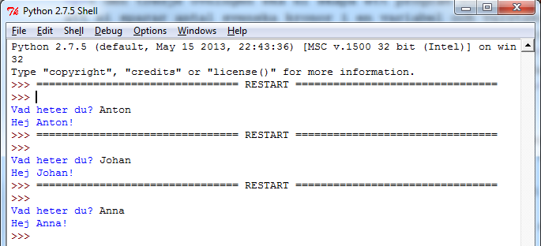

# 4. Användarinput

Hittills har vi bestämt värdet på de variabler som vi skapat, t.ex. vad vi heter, vilka tal vi vill räkna med osv. Denna information skulle ju bli mer intressant om vi kan få den från personen som använder vårt program. Vi kan i Python fråga användaren efter input/indata till vårt program genom funktionen "raw_input()".

Vill vi fråga användaren efter dennas namn (och spara det som användaren skriver in i variabeln "name") så kan vi skriva:


name = raw_input("Vad heter du? ")


Variabeln "name" kommer då att innehålla det namn som användaren angett i IDLE när programmet körs.

Vill vi sedan välkomna användaren, så kan vi helt enkelt skriva ut det namn som användaren skrev in, genom att använda oss utav variabeln "namn"


name = raw_input("Vad heter du? ")
print "Hej " + name + "!"


Det bör se ut något i stil med:

## Övningsuppgift 1

Vi ska nu utöka programmet ovan som hälsar personen välkommen. Vi ska, förutom att fråga efter personens namn, även fråga var personen bor och personens ålder. När vi är klara så ska det se ut något i denna stilen: 

Tillvägagångssätt:

1. Förutom att hämta in namnet från besökaren till ert program, ska vi nu skapa två variabler till där vi ska spara besökarens hemstad och ålder
2. Utgå från koden ovan, men modifiera den enligt:
2.1. Skapa variabeln "location" och använd funktionen *raw_input* för att hämta in svaret från användaren
2.2. Skapa variabeln "age" och använd funktionen *raw_input* för att hämta in svaret från användaren
2.3. Uppdatera "print"-raden så att den även skriver ut besökarens hemstad och ålder (så att det ser ut som på bilden ovan)

## Övningsuppgift 2

Vi ska nu bygga ett enkelt multiplikationsprogram. Programmet kommer att fråga användaren efter två tal, sedan visa produkten av dessa talen. 

* Tänk på att den input som man får från användaren genom funktionen *raw_input* är av datatypen sträng. Alltså - för att räkna med de tal som användaren skriver in behöver vi göra om numret till ett tal (genom funktionen *int()*), t.ex. såhär:


number1 = int(raw_input("Tal 1: "))


I övrigt är det upp till er hur ni konstruerar programmet, så länge resultatet liknar utskriftsbilden ovan.