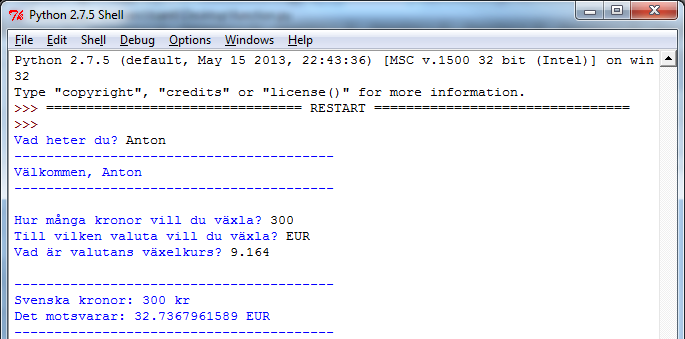

# 4. Struktur av program

## Introduktion

När man programmerar är det viktigt att ha en bra och tydlig struktur på sitt program. Ett sätt att åstakomma detta är att noga dela upp sin kod i mindre funktioner, där _en funktion gör en sak_. På så sätt delar man upp sin kod i mindre bitar och koden blir mycket mer lättöverskådlig. I denna övning ska vi träna på att strukturera upp vår kod på ett bra sätt.

Se följande exempel. Vi har ett program som låter användaren multiplicera tre tal med varandra och programmet skriver sedan produkten av talen:


name = raw_input("Vad heter du? ")
print "*"*30
print "Välkommen " + name + "!"
print "I detta program kan du mulitplicera tre tal med varandra - så beräknar vi produkten åt dig."
print "Du kommer nu att får mata in de tre tal som du vill multiplicera med"
num1 = int(raw_input("Vilket är tal nr.1: "))
num2 = int(raw_input("Vilket är tal nr.2: "))
num3 = int(raw_input("Vilket är tal nr.3: "))
result = num1 * num2 * num3
print "Produkten av dina valda tal är: " + str(result)
print "*"*30


Detta program skulle vi kunna dela upp i mindre bitar - för att få en bättre och tydligare struktur. T.ex. såhär:


def multiplyProgram():
    ''' Huvudfunktionen för multiplikationsprogrammet '''
    name = getName()
    welcome(name)
    num1 = getNumber(1)
    num2 = getNumber(2)
    num3 = getNumber(3)
    result = multiplyThreeNumbers(num1, num2, num3)
    printResult(result)
	
def getName():
    ''' Frågar besökaren efter namn '''
    return raw_input("Vad heter du? ")

def welcome(name):
    ''' Välkomnar besökaren och berättar programmets funktion '''
    print "Välkommen " + name + "!"
    print "I detta program kan du mulitplicera tre tal med varandra - så beräknar vi produkten åt dig."
    print "Du kommer nu att får mata in de tre tal som du vill multiplicera med"

def getNumber(number):
    ''' Frågar användaren efter ett tal '''
    return raw_input("Vilket är tal nr." + str(number) + ": ")

def multiplyThreeNumbers(number1, number2, number3):
    ''' Beräknar produkten av tre tal '''
    return int(number1) * int(number2) * int(number3)

def printResult(result):
    ''' Skriver ut resultatet och tackar användaren '''
    print "Produkten av dina valda tal är: " + str(result)
    print "*"*30

multiplyProgram()


Själva programmet ovan styrs av funktionen `multiplyProgram` (som sedan använder sig utav de övriga funktionerna) som vi kör längst ner i vårt kodexempel ovan. Skulle man vilka "optimera" funktionen `multiplyProgram` så skulle man kunna skriva funktionen på detta sätt:


def multiplyProgram():
    ''' Huvudfunktionen för multiplikationsprogrammet '''
    welcome(getName())
    printResult(multiplyThreeNumbers(getNumber(1), getNumber(2), getNumber(3)))


Till en början kan det tyckas att man skriver "mycket" kod när man delar upp sitt program i funktioner. Men ju mer kod man skriver ju nödvändligare blir det. Detta inte bara för att få en bättre översikt över sitt program, utan också för att saker som felsökning blir mycket enklare om man delat upp sitt program i funktioner. Dessutom händer det ofta att man återanvänder funktioner, som t.ex. funktionen `getNumber` ovan - och man vill ju inte skriva samma kod mer än en gång!

### Övning 1

I denna del ska vi återanvända funktionen `yardsToMeters` som ni skrev i den förra övningen. Ni ska uppdatera ert program så att de olika delarna nu hamnar i en egen funktion (en funktion gör en sak), och ni ska ha följande funktioner:

* En huvudfunktion som styr hela programmet (likt `multiplyProgram` ovan)
* En funktion som välkomnar användaren
* En funktion som frågar efter antalet meter
* En funktion som beräknar resultatet
* En funktion som presenterar resultatet

Inspireras gärna av exemplet i introduktionen till denna övningsdel

## Övning 2

I denna övningen ska vi göra strukturera upp ett valutakonverteringsprogram, en förbättrad variant från det som ni byggde i modul 1. Programmet ska vara uppdelat i lämpliga funktioner, med en huvudfunktion som styr programmet. Det är upp till er hur ni väljer att dela upp de olika funktionerna. Diskutera sedan gärna med labbhandledaren kring er lösning - varför har ni strukturerat upp programmet som ni gjort? Vad hade ni kunnat göra annorlunda?

Resultatet av ert program ska vara följande:

