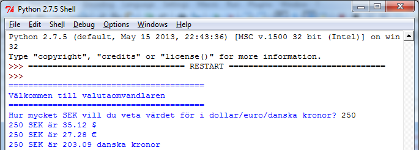

# 5. Moduler i Python

## Introduktion

När man i Python börjar att skriva större program, med mycket kod, så är det inte så smidigt att spara all kod i ett och samma dokument. Det blir dels svårt att hitta saker i ett långt dokument och dels försvåras underhållet av koden. Det kan då istället vara bra att dela upp koden i mindre delar och att spara de mindre delarna i separata filer. Man skulle t.ex. kunna ha alla funktioner som gör en typ av beräkning i en separat fil (modul) och alla funktioner som sköter huvudprogrammet i en annan. På så sätt blir programmet uppdelat i _moduler_ där varje fil representerar en modul.

### Standardmoduler i Python

Det finns en del standardfunktioner i Python som alltid finns tillgängliga (t.ex. funktionen `print`), sedan finns det andra standardfunktioner som blir tillgängliga genom att man importerar standardmoduler till sitt program. Genom att importera en standardmodul får man tillgång till fler inbyggda funktioner - och man importerar helt enkelt de moduler som behövs just till det program man bygger nu.

Syntaxen för att importera en modul ser ut såhär:


import modulNamn


Det finns en modul i Python som heter _math_ som innehåller funktioner med matematiska beräkningar. Skulle vi vilja importera den modulen skriver vi i vårt dokument:


import math


Math-modulen ger oss tillgång till många funktioner, t.ex. funktionen `ceil` som avrundar ett tal uppåt till närmsta heltal (fler funktioner i math-modulen kan ni hitta [här](https://docs.python.org/2/library/math.html#module-math)). För att använda funktionen `ceil` måste vi först referera till modulen `math` och sedan genom en `.` ange vilken funktion i modulen vi vill använda. Exempel:


import math
print math.ceil(2.2)
print math.ceil(5.9)
print math.ceil(3.5)


Ni kan se vilka standardmoduler man kan importera i Python [här](https://docs.python.org/2/py-modindex.html).

__Övning:__ Testa att importera valfri [standardmodul](https://docs.python.org/2/py-modindex.html) och testkör någon funktion från modulen.

#### Andra sätt att importera moduler

Vi kan även importera en moduls funktioner så att vi inte behöver ange modulens namn när vi kallar på funktionerna i modulen. Det kan se ut på följande sätt man importerar alla funktioner från en modul:


from math import *
print ceil(2.2)
print ceil(5.9)
print ceil(3.5)


`*` innebär att vi väljer alla funktioner för modulen. Vill vi kanske bara importera funktionen `ceil` kan vi istället skriva:


from math import ceil
print ceil(2.2)
print ceil(5.9)
print ceil(3.5)


### Egna moduler

Vi kan i Python även bygga våra egna moduler, vilket underlättar stuktur och översikt av era kommande program. En egen modul är helt enkelt ett Python-dokument med funktioner. Vi skulle kunna skapa en modul som hanterar addition och subtraktion och kalla modulen för `calcFunctions` och vi väljer då att döpa filen till _calcFunctions.py_. I _calcFunctions.py_ lägger vi till funktionerna `add` och `subtract` enligt: 


#  calcFunctions.py

def add(num1, num2):
	return int(num1) + int(num2)
	
def subtract(num1, num2):
	return int(num1) - int(num2)


Nu har vi skapat modulen _calcFunctions_. Vi skapar nu en ny fil som innehåller vårt program och döper filen till _calculate.py_ (som ligger i samma mapp som _calcFunctions.py_). Nu vill vi importera den modul som vi skapat ovan, och sedan köra funktionerna `add` och `subtract`. Det kan vi göra enligt följande:


# calculate.py
from calcFunctions import *

print add(2,5)
print subtract(18,3)


Nu har vi skapat en modul - och använt den i ett litet program. Nu är det er tur att jobba lite med moduler!

## Övning 1

I den första övningen ska vi titta närmre på standardmodulen `math` och funktionen [`math.floor`](https://docs.python.org/2/library/math.html#math.floor). Vi ska skriva en funktion som avrundar ett decimaltal neråt, till närmsta heltal. Funktionen ska ta en parameter (det tal vi vill avrunda) och returnera det avrundade talet. Resultatet ska se ut följande:

_Obs._ Glöm inte att importera `math`-modulen.

## Övning 2

Ni ska nu skriva ut dagens datum genom att använda er utav Pythons standardmodul [`time`](https://docs.python.org/2/library/time.html) och funktionen [`strftime`](https://docs.python.org/2/library/time.html#time.strftime). Det är er uppgift att i [dokumentationen](https://docs.python.org/2/library/time.html#time.strftime) för funktionen lista ut hur man använder den. Resultatet ska se ut på detta vis (fast med dagens datum):

## Övning 3

I den sista övningen ska ni bygga en egen modul. Modulen ska innehålla tre funktioner:

* krToUSD - Omvandlar svenska kronor till dollar
* krToEUR - Omvandlar svenska kronor till euro
* krToDK - Omvandlar svenska kronor till danska kronor

Funktionerna ska returnera antalet dollar/euro/danska kronor. Modulen ska heta _currencies_ och ska sedan importeras till ert program. Ert program ska heta _currencyConverter_ och fungera på följande vis:

1. Programmet frågar efter hur många svenska kr man vill veta valutavärdet för
2. Visa hur mycket dollar/euro/danska kronor man får för de inmatade svenska kronorna

Ni kommer då att ha två filer _currencies.py_ och _currencyConverter.py_. Resultatet ska se ut på detta sätt:

__Bonus:__ Använd funktionen [round](https://docs.python.org/2/library/functions.html#round) för att avrunda antal dollar/euro/danska kronor till två decimaler.

