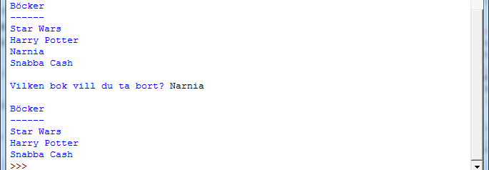

# 1. Introduktion till filhantering

## Inledning

Vi kommer i den första övningen titta på hur filhantering (läsa från och skriva till filer) fungerar i Python. Att spara undan information i filer är ett enkelt sätt att spara data mer än bara temporärt för en körning.

### Funktionen `open`

För att öppna filer i Python använder man sig utav funktionen `open`. Funktionen tar två argument

1. Vilken fil som ska öppnas/skapas
2. Hur man vill hantera filen
	- `r` (read) vi vill läsa från filen
	- `w` (write) vi vill skriva till filen (tömmer filen först)
	- `a` (append) vi vill lägga till data i filen
	- `r+` (read+) vi vill både läsa och skriva till filen

### Att skriva till en textfil

Nedan skapar vi en fil _text.txt_ genom funktionen `open`. Första parametern (`text.txt`) är namnet på filen, den andra parametern (`w`) säger att vi vill skriva till filen.


# Skapar/öppnar filen "text.txt" för att skriva till den
text_file = open('text.txt', 'w')
# Skriver lite text till filen
text_file.write("Tjoho!\n")
# Skriver ytterliggare text till filen
text_file.write("Att skriva till filer är roligt!\n")
# Avslutar användandet av filen
text_file.close()


__OBS__, om filen redan finns så skrivs tidigare innehåll över. I koden ovan skapar (eller öppnar) vi filen `text.txt` och skriver två rader text till filen. `\n` innebär en radbrytning i textfilen.

### Att läsa från en textfil

Nedan öppnar vi en befintlig text-fil och skriv ut dess innehåll. Första parametern (`text.txt`) är namnet på filen vi vill öppna, den andra parametern (`r`) säger att vi vill läsa från filen.


# Öppnar filen "text.txt"
text_file = open('text.txt', 'r')
# Skriver ut innehållet från filen
print text_file.read()
# Avslutar användandet av filen
text_file.close()


Vi öppnar alltså filen `text.txt` och skriver ut allt innehåll i filen genom funktionen `read()`.

### Att lägga till data i en fil

När man vill skriva till en fil så är det inte alltid som man vill skriva över tidigare innehåll i filen som man gör genom `open("file", "w")`, utan istället lägga till saker i slutet av filen (efter ursprunglig data). Detta göra man på följande sätt:


# Öppnar filen "text.txt" för att skriva till den
text_file = open('text.txt', 'a')
# Skriver lite mer text
text_file.write("Här kommer ännu mer text!\n")
# Avslutar användandet av filen
text_file.close()


---

#### Testkör kodexemplen ovan - testa att ändra lite, lägga till mer text i filerna - hur fungerar det?

---

## Övningar

### Övning 1 - Att skriva till en fil

Ni ska nu göra ett program som frågar användaren efter fem bra böcker. Ni ska spara titlarna för dessa fem böckerna i en fil där varje titel hamnar på en ny rad. Text-filen ska nollställas varje gång som programmet körs. Text-filen ska heta `books.txt`. Programmet ska fungera såhär:

Och er textfil ska se ut så såhär (med era angivna böcker) efter att ni kört programmet:

Kör sedan programmet några gånger och notera hur innehållet varje gång nollställs - innan ni skriver in era böcker.

### Övning 2 - Att läsa från fil

Vi ska nu bygga ett program som läser från filen som ni skapade ovan. Alltså ska ni skriva ett program som skriver ut innehållet från filen `books.txt`. Det ska se ut på följande sätt:

När ni lyckats med att skriva ut allt innehåll i filen så vill vi specificera utskriften till:

Vi vill alltså skriva ut nummer för varje bok (varje rad i filen) för att snygga till utskriften. Tänk på att det som läses ut från filen är en text-sträng, och vi kan använda funktionen `split` för att dela upp den vid varje radbrytning `\n` (vid varje bok). Något i stil med:


text_file = open('books.txt', 'r')
books =  text_file.read().split("\n")


### Övning 3 - Att skriva ytterligare information till en fil

Vi ska nu skriva ett program som användare sig utav samma textfil som tidigare (`books.txt`), men nu ger användaren att lägga till en film i taget. Programmet ska genom en `while`-iteration fråga användaren (när användaren lagt till en bok) om denna vill lägga till ytterligare en bok. Detta tills användaren svarar "nej".

### Övning 4 - Att ta radera från en fil

I sista övningen ska vi ge användaren möjlighet att ta bort en bok ur samlingen - alltså ta bort en rad från filen. Det ska fungera på följande sätt:

__Tips:__ En idé kan vara att läsa in alla böckerna från textfilen i en lista (m.h.a. funktionen `split()`), och sedan gå igenom listan och ta bort den titel som användaren angav. När det är klart skriver ni sedan kvarvarande böckerna i listan till filen igen.