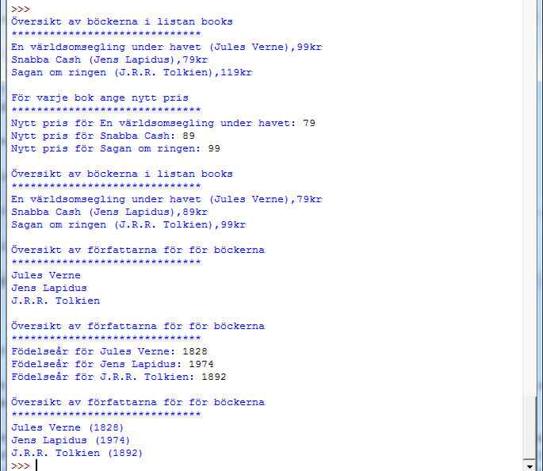

# Inlämningsuppgift 5

## 1. Introduktion

Denna inlämningsuppgift har som syfte att examinera modul 6 som har fokus på objektorienterad programmering.

Inlämningsuppgiften är individuell. Det betyder att studenten enskilt ska utforma och skriva sin inlämning samt kunna redogöra för alla delar av den. Det är så klart inte förbjudet att diskutera uppgiften. Men viktigt är alltså att det man lämnar in representerar ens egna arbete.

## 2. Uppgiftsbeskrivning

Vi ska i denna uppgift bygga ett litet program som ska hantera böcker och författare. Hanteringen ska ske genom två klasser:

1. book
2. author

Klasserna ska sedan ha följande attribut:

1. book
	- Attribut: `title` (string)
	- Attribut: `author` (objekt, av typen author)
	- Attribut: `price` (int)
	- Metod: `get_title`
	- Metod: `set_title`
	- Metod: `get_author`
	- Metod: `set_author`
	- Metod: `get_price`
	- Metod: `set_price`
	- Metod: `__str__`
2. author
	- Attribut: `name` (string)
	- Attribut: `born_year` (string)
	- Metod: `get_name`
	- Metod: `set_name`
	- Metod: `get_born_year`
	- Metod: `set_born_year`
	- Metod: `__str__`
	
Ni ska påvisa användning av er klasser genom att skapa minst tre böcker, med tillhörande författare. Varje bok ska alltså kopplas till en författare genom bokens attribut `author` (som ska innehålla ett `author`-objekt).

En exempelkörning för att skapa en bok med tillhörande författare skulle t.ex. kunna se ut såhär då:


author = author("Jules Verne")
book = book("En världsomsegling under havet", author, 99)


Där vi först skapar ett objekt av klassen `author`, en författare, i detta fall _Jules Verne_ och sedan en bok som han skrivit. Till boken anger vi då titeln, författaren och priset på boken. _Böckerna ska sedan läggas i en __lista__ som heter `books`_.

#### Krav för testkörning av er kod

Era böcker ska alltså ligga i en lista som heter `books` och ska fungera med följande kod:


for book in books:
    print book


Som ger en liknande utskrift som denna:

Ni ska också har fungerande `get` och `set`-funktioner för klasser. Så man t.ex. i en körning kan ändra värde på attributen i era objekt:

### Exempelkörning

Detta är en exempelkörning hur ert program (minimum) ska fungera:

## Bedömning

Uppgiften kan ge betyget godkänt. För att nå detta betyg behöver programmet uppfylla uppgiftsbeskrivningen, vara välstrukturerat och väldokumenterat. Extra viktiga punkter är:

- Koden ska vara strukturerad med ett antal funktioner, där varje funktion har begränsat syfte och omfattning
- Koden ska vara tydlig och lättläst med avseende på namngivning, strukturering och kommentarer. Funktioner som inte är självförklarande ska ha en beskrivning i form av _docstrings_ (`''' Kommentar för funktionen '''`-kommentarer).

### Specifika krav för uppgiften

- Ni ska använda er utav två klasser (`books` och `author`) för att bygga programmets funktionalitet
- Ni ska inkludera en exempelkörning (skriva en egen) på användandet av era klasser (minimum det som visas under sektionen _exempelkörning_)

## Redovisning

Redovisa genom att ladda upp programmets källkod på It's Learning.

Inlämningsuppgifter rättas varje vecka, med tisdag som rullande deadline. Det betyder: lämna in senast tisdag för rättning samma vecka. Försök att hålla kursens tempo på en modul per vecka. Lämplig inlämningstid för modul 6: senast _tisdag 2014-10-14_.

