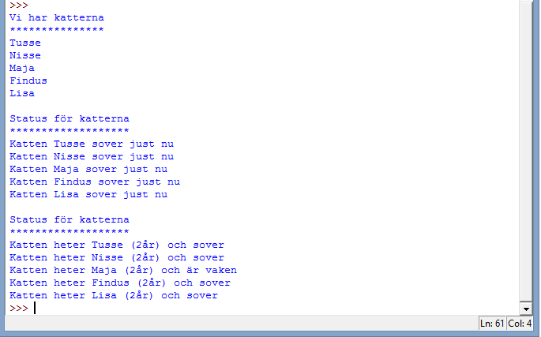

# 1. Introduktion till objektorientering

## Inledning

Vi ska i denna övning introducera oss i objektorienterad programmering i Python.

### Att skapa en klass

En klass i Python skapar man genom `class` följt utav namnet man vill att klassen ska ha. Vi vill här skapa klassen `cat` vilken ska representera en katt i vårt program. Functionen `__init__` körs automatiskt när man skapar en instans (ett objekt) av klassen, och tilldelar i koden nedan katten ett namn.


# Skapar klassen cat
class cat:
    def __init__(self, name):
        self.name = name
	
	def __str__(self):
		return "Katten heter " + self.name

# Skapar en katt som heter "Tusse"
my_cat = cat("Tusse")
# Skriver ut klassen
print my_cat


När man skrivet ut en instans av ett objekt (som vi gör genom `print my_cat` ovan), så kallas funktionen `__str__` som bestämmer vad som ska skrivas ut.

## Övning 1 - Fler attribut till klassen

Ni ska i första övningen ge klassen `cat` (utöver attributet `name`), attributen `age` (int) och `asleep` (boolean). `age` ska innehålla kattens ålder i år, och `asleep` ska hålla reda på om katten är vaken eller sover (`True` så sover katten, `False` så är katten vaken). När vi skapar en instans av katten ska åldern bestämmas (skickas med som argument, precis som namnet), men katten ska alltid, när den skapas, vara vaken. Följande kod ska fungera för att skapa en katt:


my_cat = cat("Tusse", 2)


Uppdatera sedan `__str__`-funktionen så att den även skriver ut åldern på katten, och om katten är vaken eller sover. Det ska se ut såhär när ni är klara:


my_cat = cat("Tusse", 2)
print my_cat


## Övning 2 - Metoder till klassen

Vi ska nu skriva fyra metoder till katten:

- `get_name` (som returnerar kattens namn)
- `sleep` (som ändrar en katts attribut `asleep` till True)
- `wake_up` (som ändrar en katts attribut `asleep` till False)
- `is_asleep` (som returnerar om katten är sover)

Genom funktionerna `sleep`, `wake_up` kan vi nu i vårt program söva och väcka de katter som vi har i vårt program. När ni skrivit funktionerna så testkör så att det fungerar som förväntat genom koden:


my_cat = cat("Tusse", 2)
if my_cat.is_asleep():
    print "Katten " + my_cat.get_name() + " sover just nu"
else:
    print "Katten " + my_cat.get_name() + " är vaken just nu"
my_cat.sleep()
if my_cat.is_asleep():
    print "Katten " + my_cat.get_name() + " sover just nu"
else:
    print "Katten " + my_cat.get_name() + " är vaken just nu"


Koden ovan skapar först en katt, tittar om katten är vaken/sovande (och skriver sedan ut detta). Funktionen `sleep` körs sedan för vår katt (söver katten) och sedan återigen, tittar om katten är vaken/sovande (och skriver sedan ut detta).

Det ska bli följande resultat:

## Övning 3 - Flera katter i en lista

Ofta när man har klasser så vill man skapa många instanser av just den klassen. Vi ska nu:

1. Skapa fem katter
2. Skriva ut namnet på alla fem katterna
3. Söva alla katterna genom en `for`-loop
4. Skriva ut namn och status för katterna (vaken/sovandes)
5. Välj en katt som du väcker
6. Skriv ut alla katterna genom `__str__`-funktionen

För att hålla reda på alla katterna så använd en lista. När vi vill göra något som involverar alla katterna (skriva ut namn/ändra status för vaken/sovande osv.) ska vi använda oss utav en `for`-loop för att gå igenom listan av katter.

När ni är klara ska utskriften se ut något i stil med:

